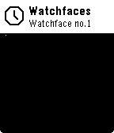

# Watchface No. 1
A simple, modular watchface for the Pebble platform.




# Content
The watchface currently contains the following layers:
* Time
  * Hour, Minute and Second (if enabled in configuration)
* Date
  * Showing current Weekday abbreviation, day of month and month
* Battery (Text)
  * Showing current battery level
* Battery (filled Icon)
  * Showing a little lightning icon when connected to charger
  * Animated when charging
* Heartrate Monitor (animated Image + Text)
  * Animated at the displayed heartrate
    * The animation will only play 10 times to improve battery life
    * The animation will play when opening the watchface or the heartrate value has changed
* Phone connection indicator (image)
  * Crossed out when disconnected from phone
* Weather (Text)
  * Showing current temperature

# Theme
The Theme can easily configured using the build in Settings screen, accessible in the Pebble app.
After saving your modified settings, the watchface needs to be restarted to reload the changed settings.
To do this you can open the Pebble main menu and close it right after. The watchface will then have to reinitialize and load all settings from scratch.

The ```Enable Animations``` option currently has <b>no effect</b> and animations are always on. This will change in a future release.


These are the two main Themes:


# Fonts
There are multipe variables to specify the font that should be used for every component of the watchface. Currently those can only be changed in code. Have a look at the ```set_fonts()``` method in  ```Theme.c``` to modify them.

# License

    MIT License
    
    Copyright (c) 2017 Markus Ressel
    
    Permission is hereby granted, free of charge, to any person obtaining a copy
    of this software and associated documentation files (the "Software"), to deal
    in the Software without restriction, including without limitation the rights
    to use, copy, modify, merge, publish, distribute, sublicense, and/or sell
    copies of the Software, and to permit persons to whom the Software is
    furnished to do so, subject to the following conditions:
    
    The above copyright notice and this permission notice shall be included in all
    copies or substantial portions of the Software.
    
    THE SOFTWARE IS PROVIDED "AS IS", WITHOUT WARRANTY OF ANY KIND, EXPRESS OR
    IMPLIED, INCLUDING BUT NOT LIMITED TO THE WARRANTIES OF MERCHANTABILITY,
    FITNESS FOR A PARTICULAR PURPOSE AND NONINFRINGEMENT. IN NO EVENT SHALL THE
    AUTHORS OR COPYRIGHT HOLDERS BE LIABLE FOR ANY CLAIM, DAMAGES OR OTHER
    LIABILITY, WHETHER IN AN ACTION OF CONTRACT, TORT OR OTHERWISE, ARISING FROM,
    OUT OF OR IN CONNECTION WITH THE SOFTWARE OR THE USE OR OTHER DEALINGS IN THE
    SOFTWARE.

